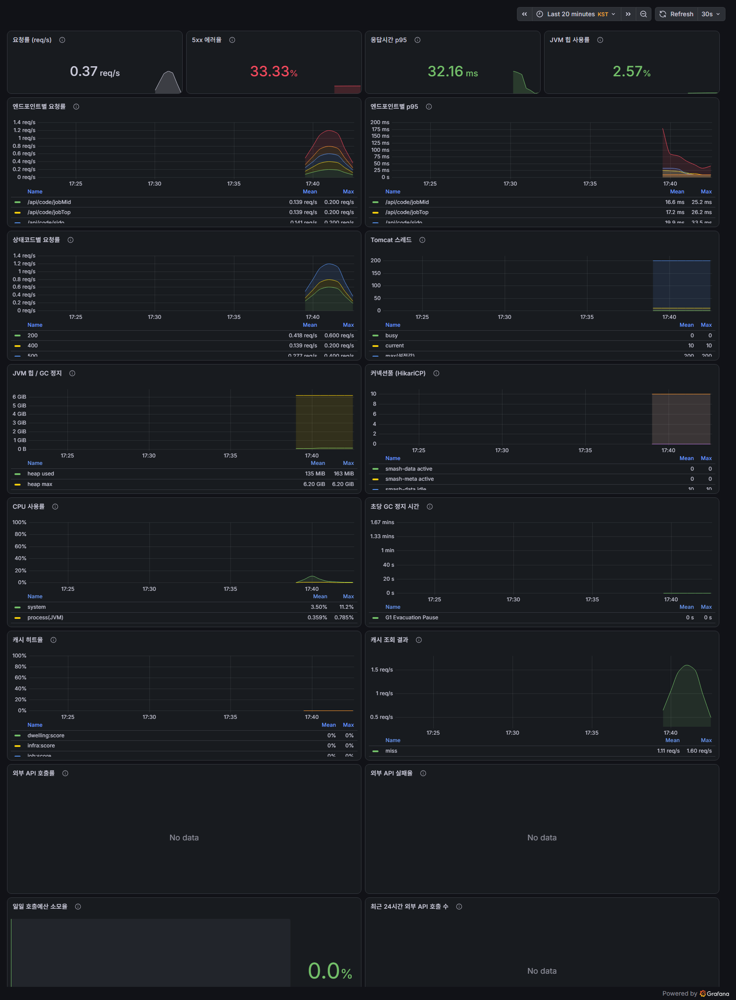
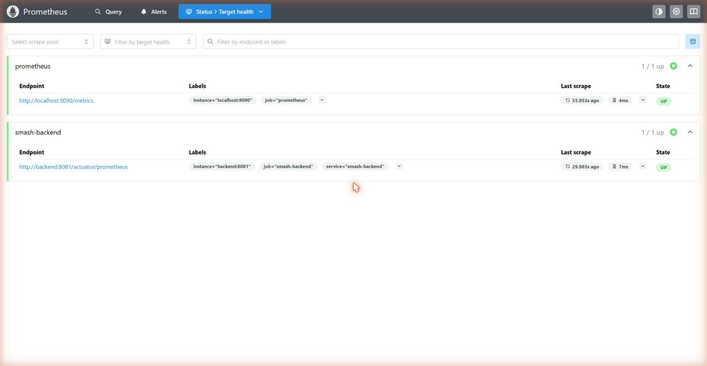

# 🏙️ 청년 지방 이주 정보 통합 플랫폼

[](https://github.com/LeeHyunWoo02/ProvinceHow/actions/workflows/cicd.yml)
[](https://openjdk.org/projects/jdk/17/)
[](https://spring.io/projects/spring-boot)
[](https://gradle.org/)
[](./LICENSE)

> 흩어진 지방 이주 정보를 한곳에 모아, "생각만 하던 지방 이주"를 실제 행동으로 바꾸는 백엔드 API 서버입니다.

## 목차
- [프로젝트 개요](#-프로젝트-개요)
- [핵심 목표](#-핵심-목표)
- [주요 기능](#-주요-기능)
- [서비스 차별점](#-서비스-차별점)
- [시스템 아키텍처](#️-시스템-아키텍처)
- [개발 환경](#️-개발-환경)
- [빠른 시작](#-빠른-시작)
- [데이터 배치 파이프라인](#️-데이터-배치-파이프라인)
- [관측성](#-관측성)
- [테스트](#-테스트)
- [기대 효과](#-기대-효과)
- [라이선스](#-라이선스)
- [팀 소개](#-팀-소개)

---

## 📘 프로젝트 개요
현 대한민국은 수도권으로 인구가 집중되고, 지방은 청년층의 유출이 누적되어 지역 소멸 위험이 커지고 있습니다.
반면 수도권의 주거비는 치솟아 청년이 장기적으로 정착하기 어렵고, 원격 근무 확산으로 지역 분산 근무가 현실적인 선택지가 되고 있습니다.

본 서비스는 **청년이 자신의 조건에 맞는 지방 정착 후보지를 효율적으로 탐색**하고,
**정보 탐색에서 실제 신청까지의 과정을 단순화**하여 수도권 과밀과 지방 인구 감소 문제를 완화하는 것을 목표로 합니다.

---

## 🚀 핵심 목표
- 흩어진 지방 이주 관련 정보를 **한 화면에서 통합 제공**
- 개인 조건에 맞춰 **맞춤형 지역·일자리·지원 제도 추천**
- 탐색에서 상담·신청으로 이어지는 **짧고 명확한 사용자 경로 제공**
- "생각만 하던 지방 이주"를 **실제 행동으로 전환**

---

## 🧭 주요 기능
| 구분 | 기능 | 설명 |
|---|---|---|
| 🔍 지역 탐색 | 통합 조회 | 지역 선택 시 해당 지역의 채용 정보, 주거비, 지원 제도, 생활 인프라를 통합 조회 |
| 🧩 맞춤 필터 | 조건 기반 추천 | 희망 산업·직무, 예산, 통근 시간, 생활 선호도 기반 자동 필터링 |
| 🏠 지원 제도 안내 | 정책 정보 | 주거·이사비·교통·창업 등 지자체별 청년 지원 정책 제공 |
| 📊 비교 뷰 | 지표 비교 | 선택한 지역 간 핵심 지표를 직관적으로 비교 |
| 🔗 원클릭 이동 | 신청 연계 | 지자체 공식 페이지로 직접 연결되어 상담 및 신청으로 즉시 전환 |

---

## 💡 서비스 차별점
1. **정보 통합성**
   정부·지자체·공공데이터(API)에서 제공하는 분산된 정보를 하나의 플랫폼에서 통합.
2. **사용자 중심 설계**
   청년이 실제 결정을 내리기 위해 필요한 정보만 요약 제공.
3. **비교의 단순화**
   동일 시점·동일 지역 단위의 정보 비교를 자동화.
4. **행동 유도형 UX**
   복잡한 탐색 과정을 줄이고 실제 신청 단계로 자연스럽게 이어짐.

---

## 🏗️ 시스템 아키텍처


### 🔹 프런트엔드
- **Vite + React + TypeScript + Tailwind CSS**
- 배포: **Vercel**
- 기능: 사용자 입력, 지역별 데이터 시각화, 비교 UI

### 🔹 백엔드
- **Spring Boot (Java)**
  - Java 17, Spring Boot 3.5.7 사용
  - Gradle(Groovy) 기반 빌드 시스템, jar 패키징
- **Docker**로 컨테이너화되어 **Oracle Cloud Infrastructure(OCI)** 컴퓨트 인스턴스에서 실행
- API 통합 및 데이터 가공 로직 담당
- **Redis**를 통한 캐싱 처리
- 도메인 주도 설계(DDD) + 헥사고날(포트&어댑터) 구조 — 컨텍스트별 `domain / application / infrastructure / presentation` 4계층 분리

### 🔹 데이터베이스
- **MySQL 8 컨테이너** — 스키마 분리 (`smash_data` 업무 데이터 / `smash_meta` Spring Batch 메타)
- 애플리케이션·DB·Redis를 **docker compose 한 세트**로 기동
- 공공데이터 API (고용24, 국토교통부, LOCALDATA 등)에서 실시간 정보 수집

### 🔹 인프라
- **Oracle Cloud Infrastructure(OCI)** 컴퓨트 인스턴스에서 Docker Compose로 운영
- **Caddy**로 HTTPS 리버스 프록시(`api.jibang.info`, `grafana.jibang.info`) 및 인증서 자동 관리
- **Prometheus + Grafana**로 API 트래픽·JVM·캐시·외부 API 호출을 관측
- **GitHub Actions**를 이용한 CI/CD (main push 시 Docker 이미지 빌드·푸시)

---

## ⚙️ 개발 환경

| 구분 | 기술 스택 |
|---|---|
| Frontend | React, TypeScript, Tailwind CSS, Vite |
| Backend | Spring Boot 3.5.7, Java 17, Gradle, Spring Batch, Spring Security, Redis |
| Database | MySQL 8 (Docker 컨테이너) |
| Observability | Actuator, Prometheus, Grafana |
| Infra | Oracle Cloud Infrastructure(OCI), Docker Compose, Caddy, Vercel |
| CI/CD | GitHub Actions |
| Data Source | 공공데이터포털 API (워크넷 채용정보, 국토교통부 실거래가, LOCALDATA), KOSIS 통계, 사람인 |

---

## 🏁 빠른 시작

```bash
git clone https://github.com/LeeHyunWoo02/ProvinceHow.git
cd ProvinceHow
cp backend.env.example backend.env   # 외부 API 인증키는 나중에 채워도 된다
docker compose up -d                  # backend + mysql + redis + prometheus + grafana
```

기동 후 확인 지점:

| 서비스 | 주소 | 비고 |
|---|---|---|
| Backend API | http://localhost:8080 | |
| Prometheus | http://localhost:9090 | 로컬 전용 노출 |
| Grafana | http://localhost:3001 (admin / admin) | 3000은 프론트 개발 서버와 충돌해 3001 사용 |

**인증키가 비어 있어도 서버는 정상 기동한다.** 필수 기준 데이터(시도·시군구·직종코드)만
적재되고 외부 데이터는 "미적재" 경고와 함께 건너뛴다. 키를 채우고 재기동하면 해당
배치만 살아난다.

---

## 🗂️ 데이터 배치 파이프라인

기준 데이터와 외부 갱신 데이터는 Spring Batch 로 적재한다. 기동 시 `seedMasterJob`
하나가 FK 순서를 보장하며 9개 Step 을 돌리고, 이후 갱신은 cron 스케줄러가 맡는다.

| 문서 | 내용 |
|---|---|
| [batch-data-pipeline.md](docs/batch-data-pipeline.md) | **전체 흐름, 실행 주기, 수동 실행·재실행·복구 절차** |
| [external-api-spec.md](docs/external-api-spec.md) | KOSIS / LOCALDATA / 국토부 공식 스펙 검증 결과 |
| [worknet-job-api.md](docs/worknet-job-api.md) | 워크넷 채용정보 API, 코드 매핑 정책 |
| [saramin-jobcount-batch-strategy.md](docs/saramin-jobcount-batch-strategy.md) | 사람인 500회/일 제한 하 JobCount 배치 수집 전략, 호출 예산 가드레일 |
| [localdata-infra.md](docs/localdata-infra.md) | 업종 마스터, 지역코드 매핑, ratio/score 계산식 |
| [work24-crawling-assessment.md](docs/work24-crawling-assessment.md) | 고용24 공개검색 수집 불가 판정 근거 |

---

## 📈 관측성

Actuator · Prometheus · Grafana 로 API 트래픽, JVM 상태, 캐시 히트율, 외부 API 호출/예산을 실시간 관측한다.



| 항목 | 내용 |
|---|---|
| 기본 제공 지표 | 요청률·p95, 상태코드별/엔드포인트별 응답, JVM 힙/GC, HikariCP 커넥션풀, Tomcat 스레드, CPU |
| 커스텀 지표 | 캐시 히트율(`smash_cache_lookups_total`), 외부 API 성공/실패/스킵(`smash_external_api_calls_total`), 일일 호출 예산 소진율 |
| 접근 통제 | 관리 포트(8081)는 컴포즈 내부망에만 노출, `grafana.jibang.info`는 Caddy 경유로만 접근 |

Prometheus는 `backend:8081/actuator/prometheus`와 자기 자신을 30초 주기로 스크랩한다. 로컬 검증 스택 기동 직후 `smash-backend` 타깃이 잡힌 화면:



자세한 구성, 포트 정책, 배포 후 확인 절차는 [observability.md](docs/observability.md) 참고.

---

## ✅ 테스트

```bash
./gradlew test        # Windows: .\gradlew.bat test
```

| 구분 | 실행 조건 |
|---|---|
| 단위/컨트롤러 테스트 | DB 없이 실행 |
| 통합 테스트 (`IntegrationTestSupport` 상속) | Testcontainers 가 MySQL 8.0 컨테이너를 기동 — **Docker 데몬 실행 필수** |

---

## 🌍 기대 효과
- **정보 접근성 향상:** 흩어진 데이터를 한눈에 보기 쉽게 통합
- **의사결정 시간 단축:** 나에게 맞는 지역을 빠르게 비교·선택
- **지방 인구 유입 촉진:** 실제 이주로 이어지는 행동 전환 유도
- **국가 균형 발전 기여:** 수도권 과밀 해소 및 지역 경쟁력 강화

---

## 📄 라이선스
본 프로젝트는 [MIT License](./LICENSE) 하에 배포됩니다.

---

## 👥 팀 소개
| 역할 | 이름 | 담당 |
|---|---|---|
| Design/Frontend | 임기성 | UI/UX, React 개발 |
| Backend/Data | 이현우, 신진범 | Spring Boot, DB, 인프라(OCI) 구축, 공공데이터 수집 및 통합 |

---

> ⚡ **목표:** 청년이 '지방 이주'를 단순한 선택이 아니라 **실현 가능한 행동**으로 바꾸는 것
> "지방으로 옮겨 살 수 있을까?"라는 질문에,
> **우리 서비스가 빠르고 명확한 답을 제공합니다.**
